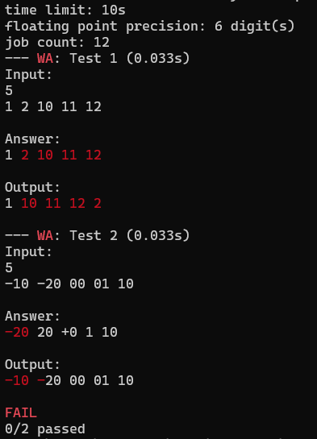

## Example 1. Bad sort

This example demonstrates the highlighting capabilities of scold.

`inputs.txt` specifies the test cases for a program that sorts integers in ascending order. The test program, however, sorts integers as if they were strings -- in a lexicographical order.

Run the example using:
```
$ go build bad_sort.go
$ scold bad_sort
```

Or, since ver2.01a, you can just do
```
$ scold go run bad_sort.go
```

The output will look like this:



1. Note that in the first test case there is a mismatch between 10 and 11, and, even though, the first characters (`'1'`) match, the numbers are highlighted fully.
2. In the second test case, there is a mismatch between 20 and -20, but only the *sign* is highlighted.
3. scold intentionally ignores presentation differences. The +0 and 00 seem different as strings, but truly *are* zeros, so no mismatch is found.
