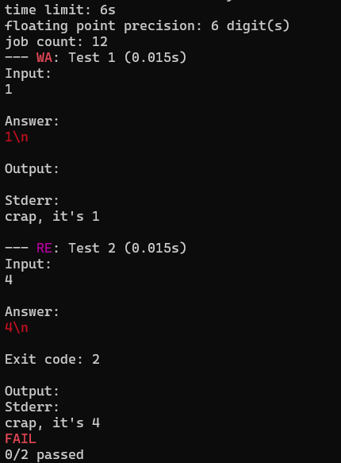

## Example 2. Runtime error

This example demonstrates how scold handles runtime errors.

`main.cpp` describes a program that reads an integers, prints it to the `stderr`, and returns non-zero code when the integer is 4.

The `inputs.txt`, however, expects that the program prints the integer it read.

Run the example like so:
```
$ g++ main.cpp -o re
$ scold re
```

The output will look like this:



Things to note:
1. `scold` correctly reports that the program exited with an error and issues a runtime error `RE` verdict for test 2.
2. For the `RE`ed tests, the exit code is printed.
3. The contents of `stderr` are printed in both `WA` and `RE` tests. Printing `stderr` for `WA` tests is handy when debugging a program, since its contents are not checked against the expected output. `stderr` is not printed on the `OK` verdict.
