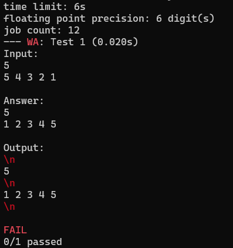

## Example 3. Newlines

This example demonstrates how `scold` handles newline discrepancies.

`main.cpp` prints a string that has an excessive newlines put between the lines.

`inputs.txt` expects only two lines.

Run the example like so:
```
$ g++ main.cpp -o re
$ scold re
```

This example just prints a line, so it can be recreated without any need to compile `main.cpp`. If you have ver2.01a and above:
```
$ scold echo "\n5\n\n1 2 3 4 5\n"
```

Or in powershell (granted that you have `echo` utility):
```
> scold echo "`n5`n`n1 2 3 4 5`n"
```

The output will look like this:



Things to note: according to the lexing rules employed by `scold`, a lone newline is a single lexeme. But, yet, `scold` correctly recognizes that the first `5` in the expected output exists in the program's output, just *after* these excessive newlines. Hence, it is seen that *only* the excessive newlines were highlighted, and the actual meaningful content was matched correctly.
