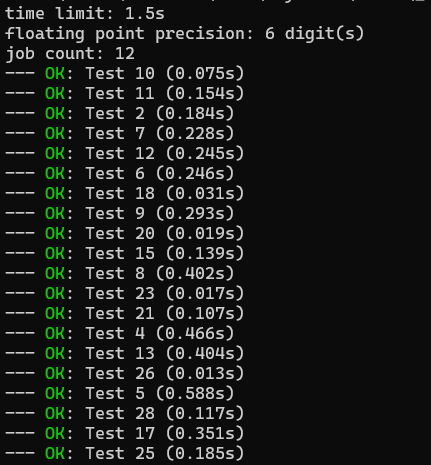

## Example 4. 1000 tests

This example demonstrates how `scold` handles huge amount of test cases.

`main.cpp` reads an integer, and starts computing a certain mathematical formula based on the read integer. The bigger the integer, the longer the program will run. Finally, it outputs the integer it read.

`inputs.txt` has 1000 tests whose inputs and outputs coincide. This file is generated by a helper program described by `gen.cpp`.

Run the example like so:
```
$ g++ main.cpp -o a
$ scold a
```

The first few lines of the output will look like this:



Things to note:
1. Only 12 programs are run simultaneously, but this default value depends on how many hardware threads are available on your computer. If you want, for example, `4`, run `scold -j 4 a`.
2. The tests are not sorted, and verdicts are printed as they become available, i.e., *in real time*.
3. Progress bar seems to be noticeably intermittent on powershell and `cmd.exe`. This seems to be a common problem with many command line tools on Windows (e.g. `rustc`). You can disable progress bar with `--no-progress` flag.
