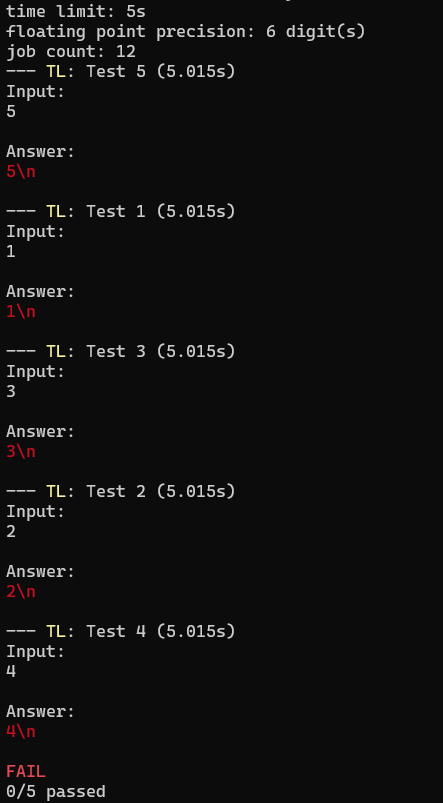

## Example 5. Endless loop

This example demonstrates how `scold` handles time limits.

`main.cpp` reads an integer and hangs forever.

Run the example like so:
```
$ g++ main.cpp -o loop
$ scold loop
```

The output will look like this:



Things to note:
1. The tests are sorted by the time they finished and not by their ids.
2. The run-time of the tests is not equal to the time limit, because it includes the time OS needed to terminate the applications.
