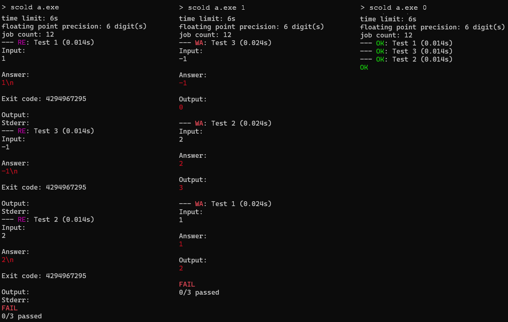

## Example 6. Application arguments

This example demonstrates how `scold` allows you to pass command-line arguments to the programs under testing.

`main.cpp` reads an integer and prints the sum of this integer with an integer passed as a command-line argument. If none were provided, it crashes.

Run the example like so:
```
$ g++ main.cpp -o args
$ scold args
```

The outputs for (a) no arguments, (b) argument `1`, and (c) argument `0` will look like this



Things to note:
1. Because of this feature, you need to be careful, since the flags designated to `scold` should appear *before* the name of the executable.
