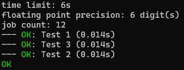

## Example 7. Testing Node.js apps

This example demonstrates how `scold` allows you to test programs that cannot be compiled.

`index.js` parses a line it reads from the `stdin` containing two integers and prints their sum.

`inputs.txt` describes a number of tests to check that summation works.

Run the example like so:
```
$ scold node index
```

The output will be



Things to note:
1. This is applicable to *any* interpreted languages and even other command-line tools. You can in the very same fashion test applications written in go, python, ruby and more.
