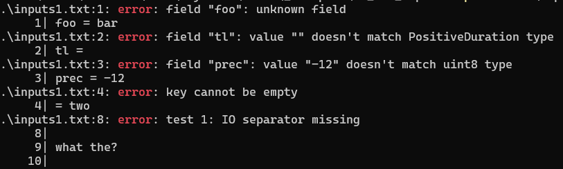

## Example 7. Input robustness

This example demonstrates how `scold` checks that the provided `inputs.txt` is correct.

Run the example like so (note that `.` is an incorrect executable name, but validation of `inputs.txt` will be performed sooner):
```
$ scold -i inputs1.txt .
```

The output will be



Things to note:
1. The error messages display the line number and the line that contains the error.
2. The error messages reference the filename and the first line of the problematic region (the `.\inputs1.txt:1:` string).
3. The error messages are capable of printing multi-line code snippets.
4. Errors are hierachical: the core error message (that goes after the last `:`) is amended with additional contextual information during the validation stage. It is in essence a Go way of reporting errors. This makes for a clean architecture inside the `scold`'s codebase, and also clearer error messages.
