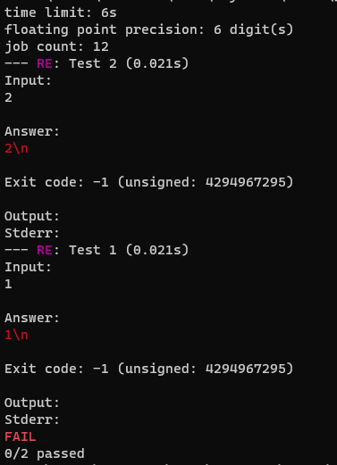

## Example 7. Negative error codes

On windows, the type of exit codes is a 32-bit integer, which, unlike POSIX with its 8 bits per error code, makes guessing what the error code means much harder.

This example demonstrates that `scold` will show you the negative versions of the error codes, if it makes sense.

Run the example like so
```
$ g++ exit.cpp -o exit.out
$ scold exit.out -1
```

The output will be



On POSIX, negative numbers won't be printed.
